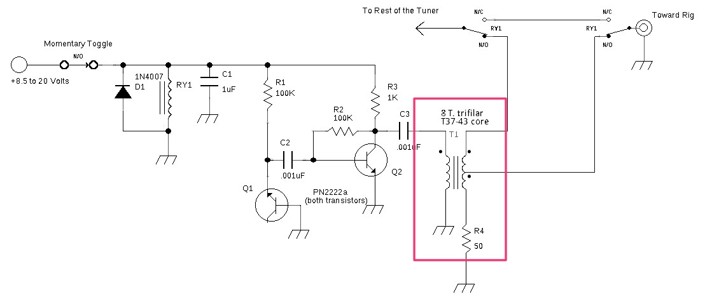
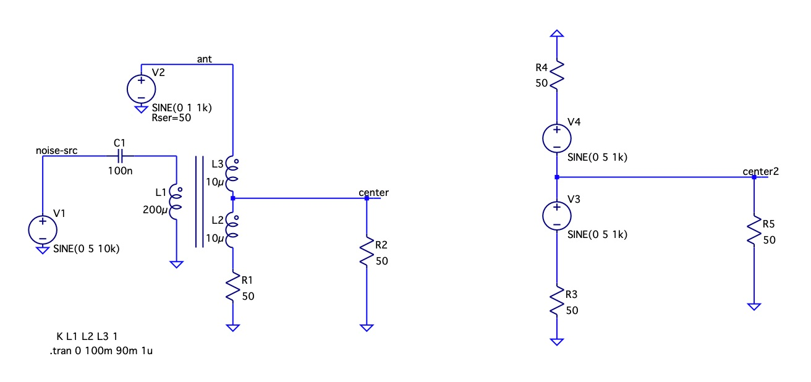

# How AC circuits work

I don't understand how AC circuits work.
It's started from http://www.nd6t.com/antenna/Polite%20Tuner.htm where the author
uses a clever method of injecting noise into the receiving signal.

Eventually, I figured out why the noise is only injected when the transformer is unbalanced i.e. the
antenna leg does not have the same impedance as the 50Ohm grounded leg.
The noise injected from the primary side can be seen as two noise sources in a series on the secondary side. 

If the legs are balanced, then the noise sources inject the same current, and when the current goes one way, say top, in the top source, then the bottom source supply exactly the same current to the center tap. Therefore the voltage at the center does not change. 
Once the legs become unbalanced, one source supplies less current, and it's not enough to compensate/cancel out the other source.

This all seems reasonable and transparent. 

Then I tested if the reactance of a simple capacitor can be seen as a "resistance" at a specific frequency and be thought of as a resistor that drops voltage and limits current.

I'm getting results that I don't expect. For example, at 1KHz the 10uF capacitor is expected to have reactance XC = 15.915 Ohms. 
I thought (naively) that I could plug reactance as resistance into a voltage divider calculator and get my Vrms or Vp-p back. Not true.
