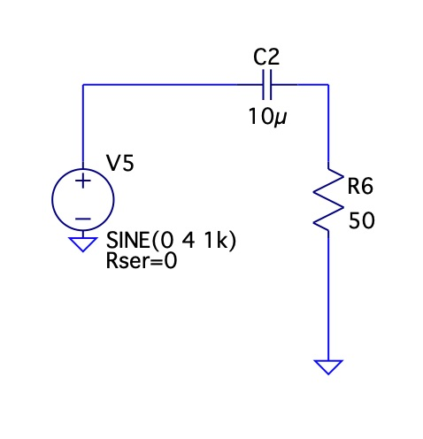

Turns out I totallt don't understand how AC circuits works.
It's started from http://www.nd6t.com/antenna/Polite%20Tuner.htm where the author
uses a clever method of injecticing noise into the receiving signal.

Eventually I fugured out why the noise is only injected when transformer is unbalanced i.e. the
antenna leg is not the same impendance as the 50Ohm grounded leg.
The noise injected from the primary side can be seen as two noise sources in series
on the secondary side. 

If the legs are balanced, then the noise sources inject the same current and when current goes one way, say top, in the top source then the bottom source supply exactly the same current to the center tap. Therefore the voltage at the center does not change. 
Once the legs become unbalanced, one of the sources supply less current, and it's not enough to compensate/cancel out the other source.

This all seems reasonable, and clear. 

Then I tested if reactance of a simple capacitor can be seen as a "resistance" at certain frequency and be though of as a resistor that drops voltage and limits current.

I'm getting results that I don't expect. 
At 1kHz 10uF capacitor is expected to have reactance XC = 15.915 Ohms
I though (naiveley)
